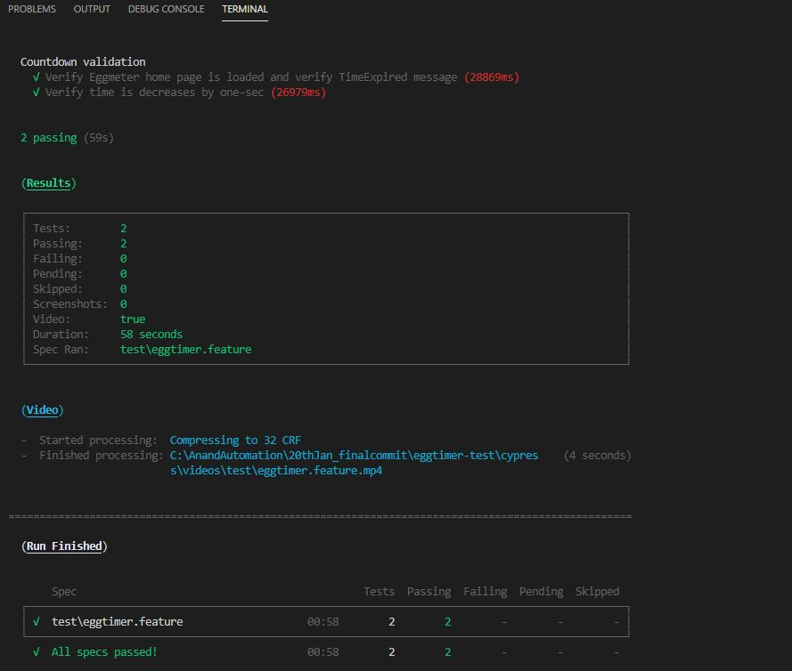
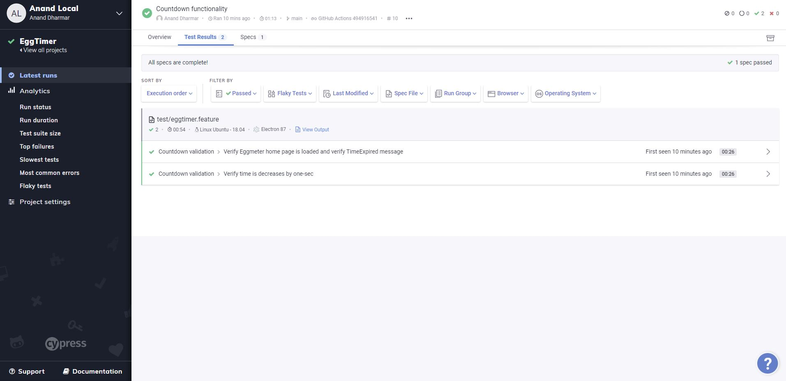
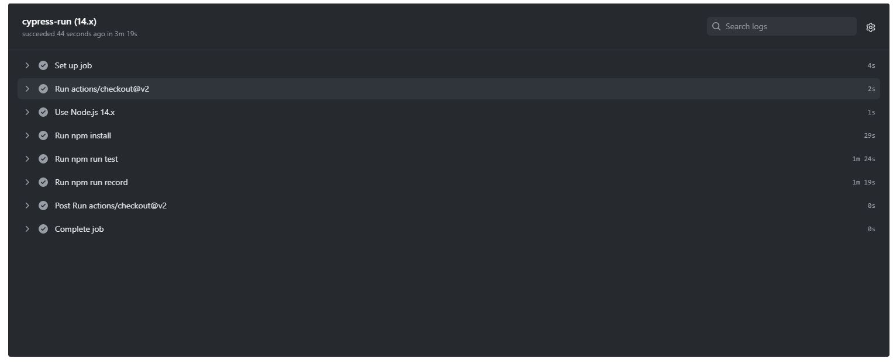

# To Get Started

## Pre-requisites

- NodeJS installed globally in the system. https://nodejs.org/en/download/
- Chrome or Firefox browsers installed
- Text Editor(Optional) installed-->Sublime/Visual Studio Code/IntelliJ IDEA Ultimate

## Setup Scripts

- Clone the repository into a folder
- Go inside the folder and run following command from terminal/command prompt
- this should install all the dependencies from package.json in node_modules folder. (Need to have Admin rights)

```
npm install
npm test
```

## CI pipeline

A pipeline for the tests are available on GitHubActions and on Azure DevOpss

## Azure Devops Pipeline

https://dev.azure.com/anandAutomation/eggtimer/_build?definitionId=1

## Reports

- Using Command lines
  
  
- Using Cypress-Dashboard
Recorded Run: https://dashboard.cypress.io/projects/ud6tod/runs/

  

- GitHubActions
  
  
  
